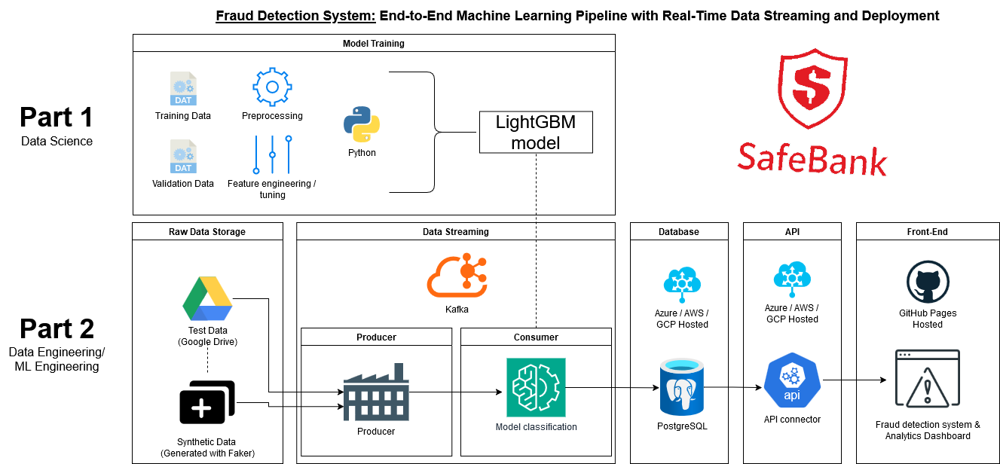

# SafeBank Data Science and Data Engineering Project

## Introduction

**Case Study:** Welcome to SafeBank, a fictional company with a critical business need.  
SafeBank requires a **data scientist** to build a machine learning model that reliably identifies fraudulent transactions using transaction data. Once the model is built, a **data engineer** is needed to deploy the model and create a robust fraud detection system.  

This project bridges the gap between **data science** and **data engineering**, demonstrating the complete lifecycle from model development to deployment.

---

## Part 1: Data Science - Building a Fraud Detection Model

This part focuses on developing a machine learning model to detect fraudulent transactions using LightGBM.  
You can read the detailed article here:  
 [SAFEBANK: Financial Fraud Detection Model Using LightGBM](https://oliver-norton.github.io/online-cv/projects/safe_bank.html)

The main Jupyter Notebook contains the steps for:
- Data exploration
- Preprocessing
- Feature engineering
- Model training and validation  

**Notebook**: [preprocess_train.ipynb](https://github.com/oliver-norton/SafeBank/blob/main/1-model-training/classification_preprocessing/preprocess_train.ipynb)

###  Progress
- **Exploratory Data Analysis (EDA):** Complete  
- **Preprocessing (including encoding):**  Complete  
- **Feature Engineering:**  Complete  
- **Training & Validation:** Complete  

---

## Part 2: Data Engineering - Creating a Fraud Detection System (In Progress)

This part involves creating a **data pipeline** that integrates the fraud detection model.  
The pipeline consists of the following steps:

1. **Raw Data Storage** (Google Drive)  
2. **Data Streaming** (Kafka)  
3. **Preprocessing & Classification** (Python scripts)  
4. **Database** (PostgreSQL)  
5. **API** (GCP/Azure)  
6. **Front-End** (GitHub Pages)  

### Workflow Overview  
The visual above illustrates the end-to-end pipeline from data storage to front-end deployment.

###  Progress
- **Raw Data Storage (Synthesised data):**  Complete  
- **Data Streaming:**  Complete  
- **Preprocessing & Classification:**  In Progress  
- **Database:**  Complete  
- **API:**  Not Started  
- **Front-End:**  Not Started  

---

##  Project Goals

- Build a scalable, production-ready fraud detection system.
- Deploy the system using modern tools like Kafka, PostgreSQL, and cloud platforms.
- Ensure end-to-end traceability, from raw data to actionable insights via a user-facing front-end.

